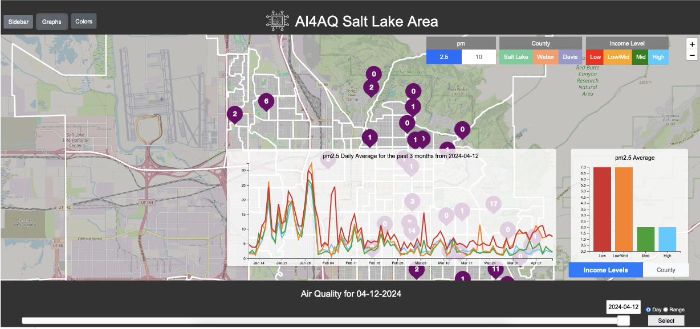
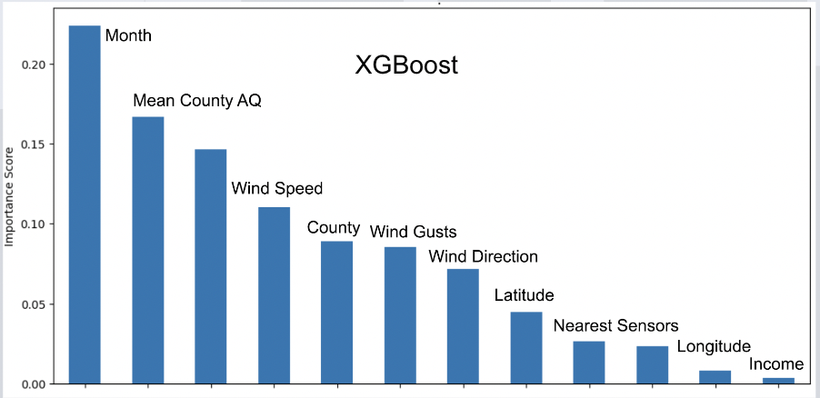
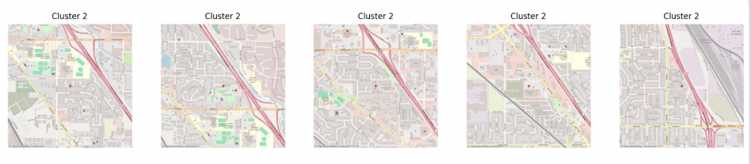
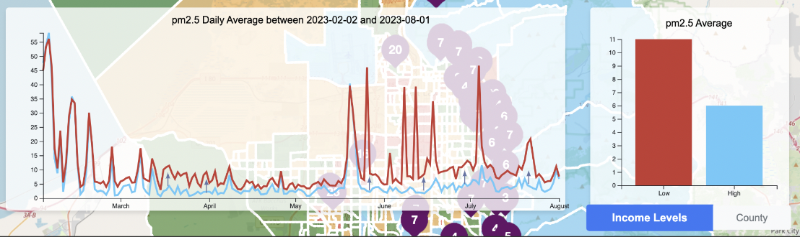

# AI4AQ - Artificial Intelligence for Air Quality

## Introduction
AI4AQ, short for Artificial Intelligence for Air Quality, is a pioneering initiative aimed at addressing the escalating air quality crisis in the Salt Lake Valley. This project was inspired by the tangible impact of poor air quality on everyday activities and the broader implications on public health, agriculture, and local economies. Our goal is to provide comprehensive, real-time air quality data to help residents make informed decisions about their outdoor activities and to support policymakers in crafting effective environmental regulations.

## Machine Learning Process and Goals
### XGBoost
Our machine learning journey began with the application of the XGBoost algorithm to determine feature importance. This model helped us identify significant predictors of air quality, such as month (due to seasonal variations like winter inversions), wind direction, and latitude. These insights guided our subsequent modeling efforts and feature engineering.

### Feed-Forward Model with CNN
Building upon the initial findings, we transitioned to a more sophisticated approach by integrating a feed-forward neural network with Convolutional Neural Network (CNN) features. This model leverages geographic features created through unsupervised clustering of map images, capturing the essence of local geographical elements like proximity to highways and parks. The combination of these models provided a robust framework for predicting air quality with enhanced accuracy.

## Dashboard Implementation
Our Flask-based web dashboard is the front-end interface where users can interact with the processed data. It features dynamic JavaScript visualizations and utilizes SQLite for data management. Users can explore air quality metrics, add virtual AI sensors to improve data coverage in sensor-sparse regions, and access personalized air quality reports. This interactive platform not only displays data but also enables users to contribute data, fostering a community-centric approach to environmental monitoring.

## Data Pipeline and Deployment
The entire application is supported by a robust data pipeline hosted on AWS. We employ services like AWS S3 for data storage, AWS Lambda for daily data updates, and AWS Secrets Manager for secure management of credentials. The CI/CD pipeline, built with GitHub Actions and Docker, ensures that our application is continuously updated with the latest code and data, maintaining high availability and reliability.

## Conclusion
AI4AQ stands as a testament to the power of integrating diverse data sources with advanced machine learning techniques to tackle environmental challenges. As we look forward, we are committed to expanding our reach, refining our models, and enhancing our dashboard to provide even more precise and actionable air quality insights.

